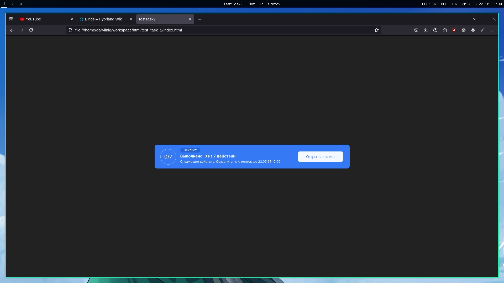

# Тестовое задание №2

## Описание

Этот репозиторий содержит тестовое задание для потверждения навыков HTML/CSS. Цель данного задания сверстать pixel perfect компонент по макету

## Требования

Компонент должен быть свёрстан используя только HTML5 и CSS3 без использования JavaScript/TypeScript

## Образец

[Ссылка](https://www.figma.com/design/zHuUDy5z2jZpdDWzOVBipJ/%D0%A2%D0%B5%D1%81%D1%82%D0%BE%D0%B2%D0%BE%D0%B5-%D0%B7%D0%B0%D0%B4%D0%B0%D0%BD%D0%B8%D0%B5?node-id=98-10642&t=058UO3UaMhjwpZaO-0)

## Скриншот

Снизу скриншот с браузера как выглядит компонент

